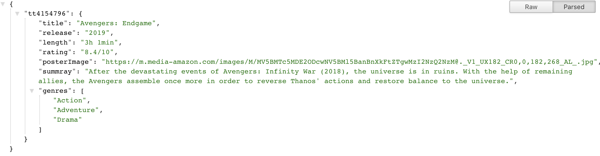
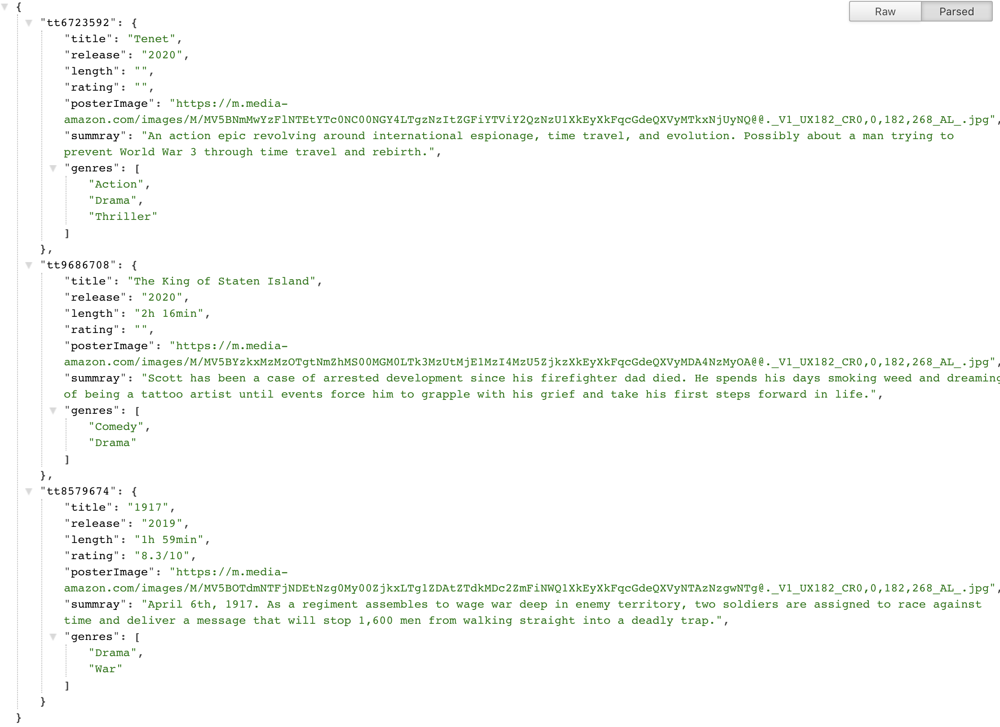
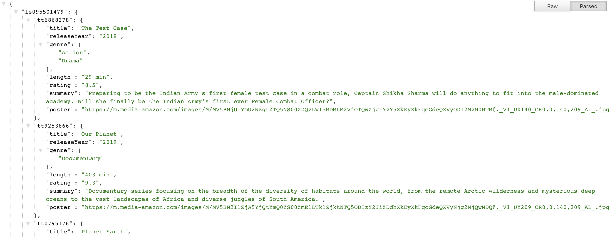

# Crawling data from website using Node.js

This is personal project for web crawling/scraping topics. It includes few ways to crawl the data mainly using [Node.js](https://nodejs.org/en/) such as:

- Imdb crawling (Node.js + [Cheerio](https://github.com/cheeriojs/cheerio) +[Request](https://www.npmjs.com/package/request))

## Installation

This project requires [Node.js](https://nodejs.org/) to run.  
Go to each project to install the dependencies and devDependencies and start the server.
For example with project Imdb Crawling

```sh
$ cd imdb-express-cheerio
$ npm install
$ npm run start
```

## Imdb Crawling

This project is particular for Imdb website https://www.imdb.com/. We can crawl both by movie id or a public list id.

### Crawl by id or list of id

To run this project, following the installation and go to `http://localhost:8000/imdb/:ids`  
With `:ids` is a list of id (delimiter by `-`) of the movies that you want to crawl
Append the querry `?out=true` at the end of URL to get the file output name `output.json` in directory.

For example with movie `Avengers: End Game`, its id is `tt4154796`. Thus, go to `http://localhost:8000/imdb/tt4154796` and view the result  


For example with list of movies such as `http://localhost:8000/imdb/tt6723592-tt9686708-tt8579674`  


### Crawl by list of movies (created by user)

To run this project, following the installation and go to `http://localhost:8000/imdb/l/:ids`  
With `:ids` is a list of list (delimiter by `-`) of the movies that you want to crawl
Append the querry `?out=true` at the end of URL to get the file output name `output.json` in directory.

For example with the list `Web series` (https://www.imdb.com/list/ls095501479), its id is `ls095501479`. Thus, go to `http://localhost:8000/imdb/l/ls095501479` and view the result  

