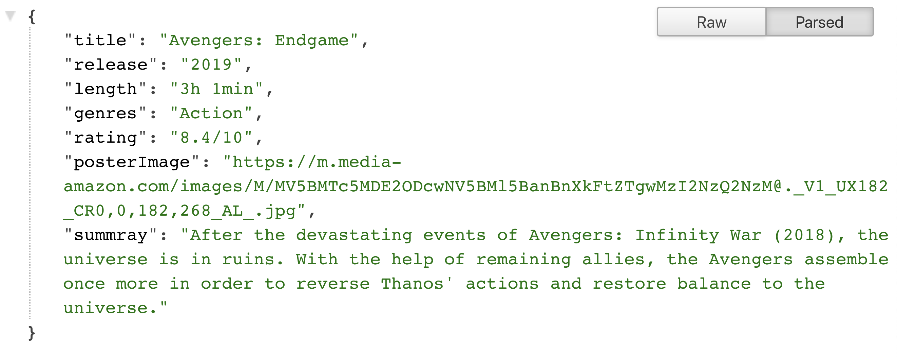

# Crawling data from website using Node.js
This is personal project for web crawling/scraping topics. It includes few ways to crawl the data mainly using [Node.js](https://nodejs.org/en/) such as:
* Imdb crawling (Node.js + [Cheerio](https://github.com/cheeriojs/cheerio))

### Installation

This project requires [Node.js](https://nodejs.org/) to run.  
Go to each project to install the dependencies and devDependencies and start the server.
For example with project Imdb Crawling
```sh
$ cd imdb-express-cheerio
$ npm install
$ npm run start
```

### Imdb Crawling
This project is particular for Imdb website https://www.imdb.com/.  
To run this project, following the installation and go to `http://localhost:8000/imdb/:id`  
With `:id` is the id of the movie you want to crawl, for example with movie `Avengers: End Game`, its id is `tt4154796`. Thus, go to `http://localhost:8000/imdb/tt4154796` and view the result  
