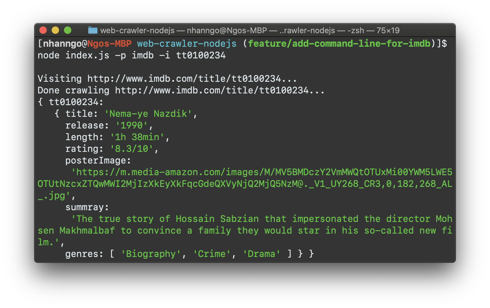

# Crawling data from website using Node.js

This is personal project for web crawling/scraping topics. It includes few ways to crawl the data mainly using [Node.js](https://nodejs.org/en/) such as:

- Imdb crawling (Node.js + [Cheerio](https://github.com/cheeriojs/cheerio) +[Request](https://www.npmjs.com/package/request))

## Installation

This project requires [Node.js](https://nodejs.org/) to run.  
Install the dependencies

```sh
$ npm install
```

## Imdb Crawling

This project is particular for Imdb website https://www.imdb.com/. We can crawl both by using CLI or running web server and perform as a RESTful API.

### Crawl by using CLI

To crawl by using cli, we need to indicate argvs after command `node index.js` with these options:

```sh
Options:
  -V, --version            output the version number
  -p, --project <project>  select a specific project. Example -p imdb
  -u, --url <url>          a path/url to the crawling site
  -i, --id <id>            id of movie or list of ids of movie delimeter by -
  -l, --list <id>          id of list or list of ids of list delimeter by -
  -o, --out <name>         output the result as <name>.json
  -h, --help               display help for command
```

Example:
```
node index.js -p imdb -u http://www.imdb.com/list/ls066692796
node index.js -p imdb -l ls066692796
node index.js -p imdb -l ls066692796 -o result
node index.js -p imdb -i tt0100234
```



### Crawl by id or list of id

To run this project, following the installation and run command `npm run start` or `node index.js`.  
Go to `http://localhost:8000/imdb/:ids` with `:ids` is a list of id (delimiter by `-`) of the movies that you want to crawl
Append the querry `?out=true` at the end of URL to get the file output name `output.json` in directory.

For example with movie `Avengers: End Game`, its id is `tt4154796`. Thus, go to `http://localhost:8000/imdb/tt4154796` and view the result  


For example with list of movies such as `http://localhost:8000/imdb/tt6723592-tt9686708-tt8579674`  


### Crawl by list of movies (created by user)

To run this project, following the installation and run command `npm run start` or `node index.js`.  
Go to `http://localhost:8000/imdb/l/:ids` with `:ids` is a list of list (delimiter by `-`) of the movies that you want to crawl
Append the querry `?out=true` at the end of URL to get the file output name `output.json` in directory.

For example with the list `Web series` (https://www.imdb.com/list/ls095501479), its id is `ls095501479`. Thus, go to `http://localhost:8000/imdb/l/ls095501479` and view the result  

